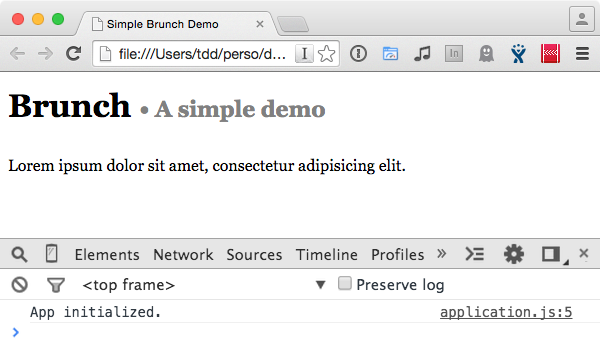
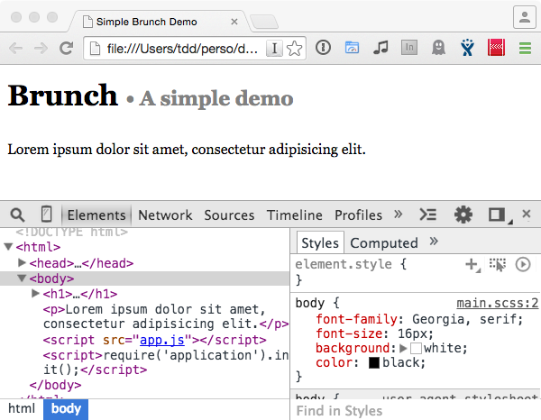
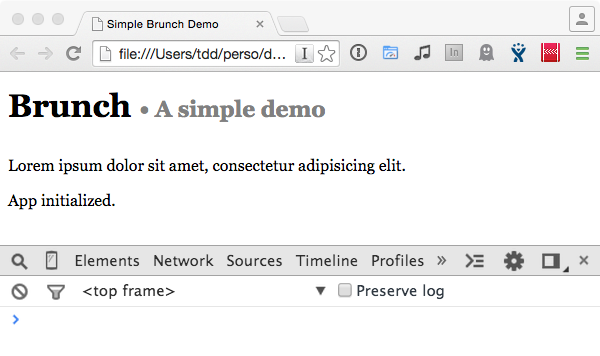

# Partir de zéro

Ceci fait partie du [Guide de Brunch.io](README.md).

Si vous avez lu attentivement les chapitres précédents, je vous dis bravo :clap:, je sais combien il peut être tentant de sauter directement à la partie code/didacticiel.  Je suis toutefois sûr que vous êtes contents d’avoir lu ces chapitres, qui restent très utiles. :grin:

## Envie de suivre facilement ?

J’ai préparé un dépôt avec toutes les étapes ci-après faciles à examiner / utiliser :

  * [Le dépôt GitHub](https://github.com/brunch/brunch-guide-demos)
  * Les archives, pour ceux qui n’utilisent pas Git : [Zip](https://github.com/brunch/brunch-guide-demos/archive/master.zip) ou [TGZ](https://github.com/brunch/brunch-guide-demos/archive/master.tar.gz).

## Juste quelques fichiers

Voyons un premier exemple, où nous resterions dans les conventions Brunch, mais sans partir d’un générateur.  On va commencer avec juste du JS (ES3/ES5), des styles via SASS, et un HTML statique.

On va donc opter pour l’arborescence de départ suivante :

```text
.
├── app
│   ├── application.js
│   ├── assets
│   │   └── index.html
│   └── styles
│       └── main.scss
└── package.json
```

Voici les fichiers de départ (vous les trouverez dans le dossier `0-starter` du dépôt) :

`app/assets/index.html` :

```html
<!doctype html>
<html>
<head>
  <meta charset="utf-8">
  <title>Simple Brunch Demo</title>
  <link rel="stylesheet" href="app.css">
</head>
<body>
  <h1>
    Brunch
    <small>• A simple demo</small>
  </h1>
  <p>Lorem ipsum dolor sit amet, consectetur adipisicing elit.</p>
  <script src="app.js"></script>
</body>
</html>
```

`app/styles/main.scss` :

```scss
$default-bg: white;
$default-text: black;

body {
  font-family: Georgia, serif;
  font-size: 16px;
  background: $default-bg;
  color: $default-text;
}

h1 {
  font-size: 2em;
  margin: 0.5em 0 1em;

  & > small {
    color: gray;
    font-size: 70%;
  }
}
```

`app/application.js` :

```js
"use strict";

var App = {
  init: function init() {
    console.log('App initialized.');
  }
};

module.exports = App;
```

Et pour finir, `package.json` :

```json
{
  "name": "simple-brunch",
  "version": "0.1.0",
  "private": true
}
```

## Installer les plugins Brunch pour démarrer

On va maintenant « installer » Brunch et le jeu minimum de plugins nécessaires, en local :

```sh
$ npm install --save-dev brunch javascript-brunch sass-brunch
…

$ npm ls -depth=0
simple-brunch@0.1.0 …
├── brunch@1.8.3
├── javascript-brunch@1.7.1
└── sass-brunch@1.8.10
```

Il nous faut à présent une **configuration Brunch** minimale.  Un fichier de configuration Brunch est un module Node qui exporte une propriété `config`, laquelle a, au minimum, besoin de la propriété `files` pour connaître les concaténations à effectuer.  Voici notre `brunch-config.coffee` :

```coffeescript
module.exports = config:
  files:
    javascripts: joinTo: 'app.js'
    stylesheets: joinTo: 'app.css'
```

Oui, **c'est tout** ! :grin:

## Notre premier build

Allez, on tente un build.  Depuis le dossier racine du projet, là où se trouve le `brunch-config.coffee` (au même niveau que `app`, donc), faites :

```sh
$ brunch build
25 Feb 17:07:20 - info: compiled 2 files into 2 files, copied index.html in 94ms
```

Remarquez le temps de build pour ce one-shot : **94 millisecondes**.  Et je suis sur un disque crypté à la volée.

Voyons ce qui a été généré dans `public` :

```text
public/
├── app.css
├── app.css.map
├── app.js
├── app.js.map
└── index.html
```

Le contenu de `assets/` est bien là (donc `index.html`), ainsi que les concaténations et leurs *source maps*.  Voyons `app.css` :

```css
/* line 4, stdin */
body {
  font-family: Georgia, serif;
  font-size: 16px;
  background: white;
  color: black; }

/* line 11, stdin */
h1 {
  font-size: 2em;
  margin: 0.5em 0 1em; }
  /* line 15, stdin */
  h1 > small {
    color: gray;
    font-size: 70%; }


/*# sourceMappingURL=app.css.map*/
```

Pas mal.  Et dans `app.js` ?  Ça commence par le *bootstrapper* de Brunch, qui fournit toute la mécanique de gestion de modules et de `require()` en un peu moins de 100 lignes, puis on trouve nos modules, correctement enrobés.  Voici les lignes 93 et suivantes, remarquez la « plomberie » de modules avec `require.register(…)` :


```js
require.register("application", function(exports, require, module) {
"use strict";

var App = {
  init: function init() {
    console.log("App initialized");
  }
};

module.exports = App;

});


//# sourceMappingURL=app.js.map
```

Comme notre JS est désormais modularisé, rien n’apparaît sur la console au chargement de la page : il va falloir **requérir le module** qui sert de point d'entrée à l'application.

Par défaut, **les modules sont nommés d'après leur chemin** au sein des chemins surveillés qui sont sujet à modularisation.  Si on n'a qu'un chemin surveillé, celui-ci ne préfixe pas (c'est notre cas, on n'a que `app` de concerné).  Si on en a plusieurs, ils préfixent le nom.  L’extension n'est pas utilisée, afin de laisser toute liberté en termes de langage source (ex. CoffeeScript ou TypeScript).

Puisque nous avons un `app/application.js`, le nom du module, comme on peut le voir dans le code ci-dessus, est tout simplement `"application"`.  Donc, ajoutons ceci en bas du `<body>` de notre `app/assets/index.html`, ligne 15 :

```html
<script>require('application').init();</script>
```

On relance le build (on verra le *watcher* tout à l'heure) :

```sh
$ brunch b # version courte de "build"
```

Et à présent, si on rafraîchit :



Remarquez le chemin indiqué dans la pile du log : `application.js:5`, et non `app.js:98` : ce sont les *source maps* en action (si vous les avez activées dans les réglages de vos Dev Tools, ce que vous devriez !).  Si vous avez ouvert la console *après* que le log a eu lieu, les *source maps* n'étaient pas encore chargées : ouvrez la console, puis rafraîchissez.

Même chose pour les CSS :



Vous voyez le `main.scss:2` comme attribution de la règle `body` ?  Et si vous cliquez dessus (ou dans les propriétés), vous irez bien sur le code source original.

## Des globales ; parce que d’abord.

Imaginons à présent que nous souhaitions utiliser jQuery, ou une autre bibliothèque.  Si nous avons déjà du code qui suppose que jQuery est global, il nous faudra soit modifier notre code (indispensable à terme), soit ne pas enrober jQuery en module (acceptable en phase de transition).

Supposons que notre `application.js` attend en fait le chargement du DOM pour injecter son contenu en fin de `<body>` :

```js
"use strict";

var App = {
  init: function init() {
    $('body').append('App initialized.');
  }
};

module.exports = App;
```

On va d'abord employer la seconde approche, celle qui voudrait que jQuery reste disponible globalement, en transition.  On pose donc notre `jquery.js` dans un nouveau dossier `vendor`, et on relance le build.  Au rafraîchissement, ça fonctionne, le message apparaît en fin de document :



Le code complet de jQuery est en fait injecté tel quel entre le *bootstrapper* de Brunch et les codes enrobés en modules.  Brunch va injecter là l'ensemble des fichiers des dossiers `vendor` dans l'ordre alphabétique (sauf à préciser des ajustements dans la configuration).

## Revenir aux modules

Mais tout de même, ce n'est pas terrible terrible, ce gros global dégueulasse qui traîne, là…  D'autant que jQuery incorpore une sorte de chargeur UMD, capable de s'exporter correctement depuis un module CommonJS.  Du coup, tentons plutôt de refactoriser notre code.

Déplaçons d'abord le `jquery.js` de `vendor` vers `app`, pour qu'il soit bien enrobé en module, et sous le nom simple `jquery`.  Vous pouvez virer votre `vendor` vide si vous le souhaitez.

Puis, ajustons `application.js` pour requérir explicitement jQuery, tant qu'à faire sous le nom local `$` (oui, local, souvenez-vous : on est dans un module, donc nos déclarations sont privées).  Regardez la ligne 3 :

```js
"use strict";

var $ = require('jquery');

var App = {
  init: function init() {
    $('body').append('App initialized.');
  }
};

module.exports = App;
```

On rebuilde, on rafraîchit, et ça marche toujours ! :heart:

## Cibles multiples

Certains suggèrent de **sortir les bibliothèques tierces du *bundle* principal**, car nous allons les faire évoluer **bien moins souvent** que notre propre code : du coup, en proposant deux cibles, une pour les codes tiers, une pour le nôtre, on exige certes deux chargements au lieu d’un initialement, mais on fait recharger un *bundle* **nettement plus petit** par la suite.

Voici un exemple de configuration Brunch qui permet cela ; comme nos codes tiers ne sont pas ici regroupés dans un même dossier de base, mais juste posés à la racine du dossier surveillé pour que leurs noms de modules soient simples (on pourrait configurer ça autrement, on le verra), on va lister explicitement les modules concernés au moyen d'une *regex*.

Voici notre `brunch-config.coffee` mis à jour :

```coffeescript
module.exports = config:
  files:
    javascripts: joinTo:
      'libraries.js': /^app[\\\/]jquery\.js/
      'app.js': /^(?!app[\\\/]jquery\.js)/
    stylesheets: joinTo: 'app.css'
```

Dès qu'on a plusieurs cibles, nos `joinTo` deviennent des objets qui mettent en correspondance un nom de cible (les noms de propriétés) avec une description des sources (les valeurs de propriétés).  Ces descriptions sont des [ensembles anymatch](https://github.com/es128/anymatch#anymatch--), à savoir des chemins spécifiques ou à base de *globbing*, des expressions rationnelles, des fonctions de prédicat, ou un tableau de ces composants (qui peuvent être mélangés).  Bref, c'est super flexible.

Notez que pour que ça marche toujours, il faut ajuster le bas de notre `app/assets/index.html` pour qu’il charge bien les deux scripts cibles :

```html
<script src="libraries.js"></script>
<script src="app.js"></script>
<script>require('application').init();</script>
```

----

Dans le chapitre suivant, nous apprendrons à utiliser des référentiels de modules tiers pour utiliser des dépendances versionnées dans notre propre code.

« Précédent : [Conventions et valeurs par défaut](chapter03-conventions-and-defaults.md) • Suivant : [Utiliser des référentiels de modules tiers](chapter05-using-third-party-registries.md) »
