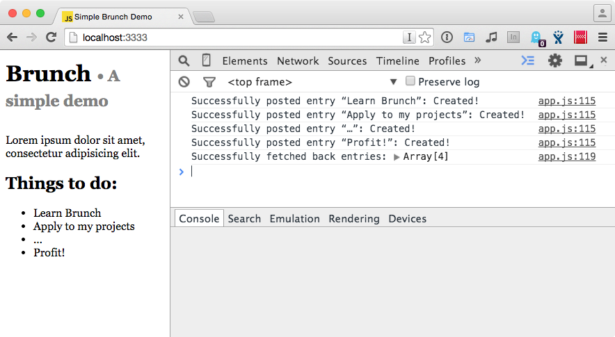

# Serveur web, intégré ou personnalisé

Ceci fait partie du [Guide de Brunch.io](README.md).

Comme je l’ai signalé plus tôt dans ce guide, le *watcher* permet aussi de lancer en parallèle un **serveur web** pour servir les fichiers produits.  Certaines technologies ont besoin que la page soit servie en HTTP(S), et une simple ouverture du fichier dans le navigateur ne suffit pas.  Ça permet aussi des URLs plus courtes…

Il existe deux manières de lancer ce serveur :

  * **Explicitement** dans la ligne commande : `brunch watch --server`, `brunch watch -s` voire `brunch w -s` si on a bien la flemme ;
  * **Via les réglages** `server` du `brunch-config.coffee`.

Le serveur par défaut est fourni en fait par le module npm [`pushserve`](https://github.com/paulmillr/pushserve), et fournit donc un peu plus qu’un bête serveur statique : il offre une gestion CORS, un routage systématique pour faciliter le recours à l’API [`pushState`](https://developer.mozilla.org/fr/docs/Web/Guide/DOM/Manipuler_historique_du_navigateur), etc.

Si vous souhaitez **toujours lancer** ce serveur quand le *watcher* démarre, il vous suffit de rajouter à la configuration le réglage suivant :

```coffeescript
server:
  run: yes
```

Si vous voulez **un port différent** de 3333, renseignez aussi le réglage `server.port` avec le numéro.

## Écrire notre propre serveur

Il n’empêche, parfois votre micro-serveur a besoin de **fonctionnalités en plus**, ne serait-ce que pour une **démo** ou une **formation**…  Voyons comment réaliser **notre propre serveur**, qui fournirait en plus deux points d’accès REST :

  * POST sur `/items` avec un champ `title` ajoute une entrée.
  * GET sur `/items` renvoie la liste des entrées.

Nous allons rester simples et utiliser ce bon vieux [Express](http://expressjs.com/), avec le minimum de modules pour fournir notre service.

On fournit un serveur personnalisé à Brunch en renseignant le réglage `server.path`, qui indique un **module** à vous.  Ce module doit **exporter une fonction `startServer(…)`** avec la signature suivante :

```js
startServer(port, path, callback)
```

Lorsque votre serveur a fini de démarrer, il appelle `callback()` pour que **Brunch reprenne la main**.  Le serveur est **automatiquement arrêté** quand le *watcher* de Brunch s’arrête.

Voici notre serveur d’exemple.  Il aurait pu être écrit en CoffeeScript, mais pour rester accessible à la totalité de mes lecteurs, le voici en JS.  Je l'ai mis dans un fichier `custom-server.js` :

```js
'use strict';

var bodyParser = require('body-parser');
var express    = require('express');
var http       = require('http');
var logger     = require('morgan');
var Path       = require('path');

// Notre fonction de démarrage serveur
exports.startServer = function startServer(port, path, callback) {
  var app = express();
  var server = http.createServer(app);

  // Stockage en mémoire des entrées gérées via REST
  var items = [];

  // Middlewares de base : fichiers statiques, logs, champs de formulaire
  app.use(express.static(Path.join(__dirname, path)));
  app.use(logger('dev'));
  app.use(bodyParser.urlencoded({ extended: true }));

  // GET `/items` -> JSON du tableau des entrées
  app.get('/items', function(req, res) {
    res.json(items);
  });

  // POST `/items` -> Ajout d’une entrée d’après le champ `title`
  app.post('/items', function(req, res) {
    var item = (req.body.title || '').trim();
    if (!item) {
      return res.status(400).end('Nope!');
    }

    items.push(item);
    res.status(201).end('Created!');
  })

  // Mise en écoute du serveur sur le bon port, notif à Brunch une fois
  // prêts, grâce à `callback`.
  server.listen(port, callback);
};
```

Pour que ça marche, on prend soin d’ajouter les modules nécessaires à notre `package.json` :

```sh
$ npm install --save-dev express body-parser morgan
```

Puis on modifie notre configuration, en rendant le serveur automatique tant qu’à faire :

```coffeescript
server:
  path: 'custom-server.js'
  run: yes
```

Tentez un *watcher* :

```sh
$ brunch w
02 Mar 12:45:04 - info: starting custom server
02 Mar 12:45:04 - info: custom server started, initializing watcher
02 Mar 12:45:04 - info: compiled 3 files into 3 files, copied index.html in 269ms
```

Remarquez les infos sur le serveur personnalisé.  Tentez un accès à `localhost:3333` désormais : ça marche !  Histoire de tester ça, modifions notre `application.js` pour qu’il utilise l’API exposée par le serveur :

```javascript
"use strict";

var count = 0;

var App = {
  items: ['Learn Brunch', 'Apply to my projects', '…', 'Profit!'],

  init: function init() {
    var tmpl = require('views/list');
    var html = tmpl({ items: App.items });
    $('body').append(html);

    $.each(App.items, function(i, item) { requestItem(item); });
  }
};

function requestItem(item) {
  $.ajax('/items', {
    type: 'post',
    data: { title: item },
    success: function(res) {
      console.log('Successfully posted entry “' + item + '”: ' + res);

      if (++count === App.items.length) {
        $.getJSON('/items', function(res) {
          console.log('Successfully fetched back entries:', res);
        });
      }
    }
  });
}

module.exports = App;
```

Le *watcher* récupère notre mise à jour, et si nous rafraîchissons la page et que nous examinons la console, nous voyons ceci :



Tout roule ! (づ￣ ³￣)づ

----

« Précédent : [*Watcher*](chapter09-watcher.md) • Suivant : [Des plugins pour tous les besoins de build](chapter11-plugins.md) »
